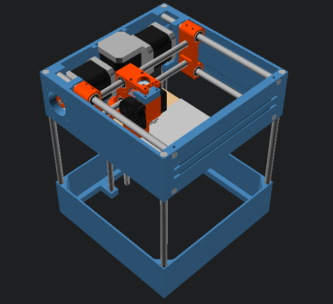

# alea

`alea` è una stampante 3D dalle dimensioni contenute che mira ad essere economica, semplice da costruire e di facile manutenzione.

### Dati tecnici

`alea` è disegnata con OpenSCAD ed è totalmente parametrica. Le sue caratteristiche dipendono dai valori in `config.scad`. In base a quelli di default i dati sono:

 * Area di stampa: `10`x`10`x`10`mm
 * Numero di estrusori: `1` (incrementabili con meccanismi analoghi al `Prometheus System`).
 * Dimensioni: `20`x`20`x`20`mm

### Perchè piccola

La ridotta area di stampa porta con sè diversi vantaggi:

 * le guide lineari più corte sono molto meno soggette a flessioni e deformazioni
 * il piatto di stampa riscaldato raggiunge la temperatura desiderata più in fretta
 * occupando poco spazio si accontenta di un angolo della scrivania
 * le barre di acciaio più corte, sono anche più economiche

Anche possedendo una stampante più grande, raramente si stampano oggetti più grandi di `10`cm.

### Cosa porta di nuovo?

 * Rispetto a quella della `DICE`, la testa di stampa pur conservando le due ventole, vanta un minore numero di parti (solo 2) ed un meccanismo di aggancio dell'hotend montato su molle. Grazie a quest'ultimo è possibile eseguire la procedura di autolivellamento del piatto di stampa senza dover aggiungere alcuna parte addizionale, come sensori di prossimità, servomotori etc... che andrebbero a occupare spazio riducendo l'area di stampa.
 * L'implementazione del meccanismo `CoreXY` è molto simile a quello già adottato dalla `Tantilot` (un'altra stampante ispirata alla Tantillus). `alea` ne adotta una variante rivista che risolve il "problema" dell'incrocio della cinghia.
 * La disposizione delle guide lineari (due per lato) che ho già sperimentato con la mia `voron600` conferisce maggiore rigidità e risolve il problema della flessione nella direzione avanti-dietro della testa di stampa.
 * Design totalmente parametrico: è possibile definire misure personalizzate per le barre di acciaio, il frame, i cuscinetti, i motori, etc...

### Nome

Il nome `alea` è un tributo ai progetti a cui essa è ispirata. `alea` in latino significa "dado" e quello della **`DICE`** ("dado in inglese") si ispira la testa di stampa ultracompatta e l'innovativo meccanismo di trasmissione `CoreXY`.  
Il nome latino richiama quello della `Tantillus` di cui `alea` intende essere, nel suo piccolo, un successore spirituale, conservandone l'utilizzo di filo da pesca in luogo delle più comuni cinghie di gomma e l'idea del frame stampabile in semplice PLA.

